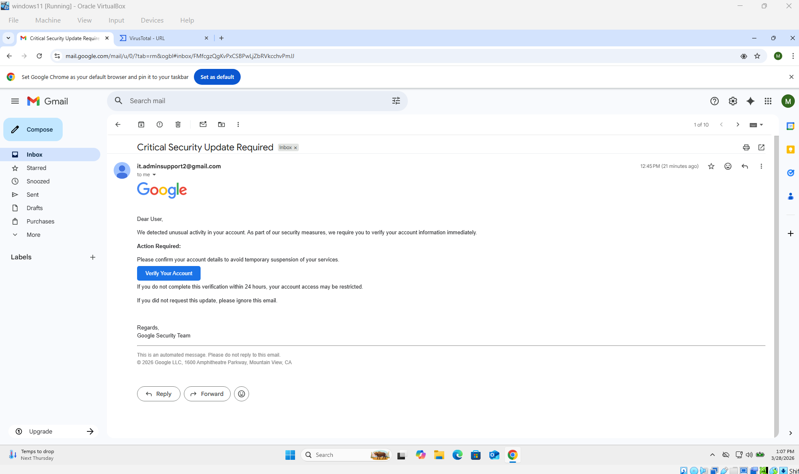
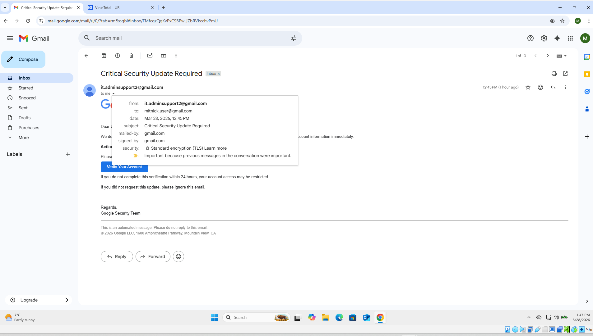
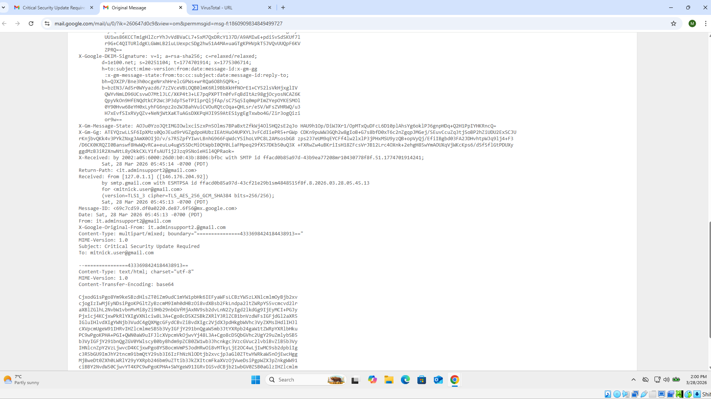
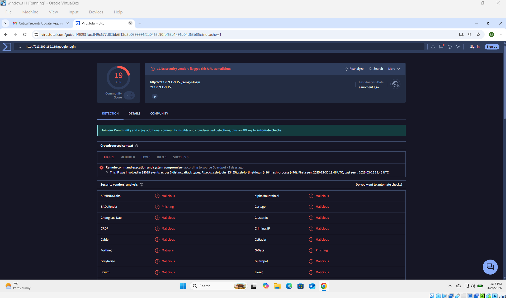

# 🎣 Phishing Email Investigation

<div align="center">


<br/>

> **SOC Lab Project #2** — Simulating, sending, and investigating a real phishing email attack  
> using Python SMTP, Gmail, and VirusTotal. Full IOC extraction, header analysis & incident report.

</div>

---

## 📌 Overview

This project demonstrates a complete phishing email investigation from **both attacker and defender perspectives**.

A phishing email was crafted and sent using Python's `smtplib` via **Gmail SMTP** from **Kali Linux** to a **Windows 11** victim machine. The email impersonated an IT support account and contained a malicious Google login URL hosted on a raw IP address. The attack was then fully analyzed — email headers inspected, IOCs extracted, URL verified on VirusTotal — and documented as a structured incident report.

---

## 🎯 Objective

- ✅ Simulate a real-world phishing email attack in a controlled lab environment
- ✅ Send phishing email using Python `smtplib` from Kali Linux via Gmail SMTP
- ✅ Analyze email headers for spoofing indicators and authentication failures
- ✅ Extract all Indicators of Compromise — email address, URL, and IP
- ✅ Verify malicious URL and IP reputation using VirusTotal
- ✅ Map attack to MITRE ATT&CK framework
- ✅ Produce a full incident report with findings and recommendations

---

## 🖥️ Lab Environment

| Machine | Role | Details |
|---------|------|---------|
| Kali Linux | Attacker | Crafts and sends phishing email via Python smtplib |
| Windows 11 | Victim | Receives and opens the phishing email |
| Gmail SMTP | Email Delivery | `smtp.gmail.com:587` used as mail relay |

---

## ⚙️ Tools Used

| Tool | Purpose |
|------|---------|
| Python `smtplib` | Craft and send phishing email via SMTP |
| `email.mime` | Build multi-part MIME email message |
| Gmail App Password | SMTP authentication without 2FA issues |
| VirusTotal | Analyze malicious URL and IP reputation |
| Email Header Analyzer | Inspect raw headers for spoofing indicators |
| Web Browser | View and inspect received phishing email |

---

## 🪜 Steps Performed

### Phase 1 — Setup

```bash
# On Kali Linux — verify Python is available
python3 --version

# Create Gmail App Password:
# Google Account → Security → 2-Step Verification → App Passwords
# Select: Mail + Other Device → Generate
```

1. Created attacker Gmail account (`it.adminsupport2@gmail.com`) — impersonating IT Support
2. Created victim Gmail account on Windows 11 to receive the email
3. Generated Gmail **App Password** on Kali Linux for SMTP authentication

---

### Phase 2 — Craft & Send the Phishing Email

**Python script used (`send_mail.py`):**

```python
import smtplib
from email.mime.multipart import MIMEMultipart
from email.mime.text import MIMEText

# SMTP Configuration
smtp_server = "smtp.gmail.com"
port = 587
sender_email = "it.adminsupport2@gmail.com"
app_password = "<your-app-password>"
receiver_email = "<victim@gmail.com>"

# Craft phishing email
msg = MIMEMultipart("alternative")
msg["Subject"] = "URGENT: Your Google Account Will Be Suspended"
msg["From"] = "IT Support <it.adminsupport2@gmail.com>"
msg["To"] = receiver_email

# HTML phishing body with fake Google login link
html_body = """
<html>
  <body>
    <p>Dear User,</p>
    <p>We have detected <strong>suspicious activity</strong> on your Google account.</p>
    <p>Your account will be <strong>suspended within 24 hours</strong> unless you verify immediately.</p>
    <p><a href="http://213.209.159.159/google-login">Click here to verify your account</a></p>
    <p>Regards,<br>Google Security Team</p>
  </body>
</html>
"""

msg.attach(MIMEText(html_body, "html"))

# Send via Gmail SMTP
with smtplib.SMTP(smtp_server, port) as server:
    server.starttls()
    server.login(sender_email, app_password)
    server.sendmail(sender_email, receiver_email, msg.as_string())
    print("[+] Phishing email sent successfully!")
```

```bash
# Run on Kali Linux
python3 send_mail.py
# Output: [+] Phishing email sent successfully!
```

---

### Phase 3 — Analyze the Received Email

```bash
# On Windows 11 — open victim Gmail in browser
# Steps:
# 1. Open Gmail inbox
# 2. Locate the phishing email
# 3. Click the three-dot menu → "Show original"
# 4. Copy full email headers for analysis
# 5. Paste into: https://toolbox.googleapps.com/apps/messageheader/
```

**Key header fields inspected:**

| Header Field | Value / Finding |
|-------------|-----------------|
| `From` | `it.adminsupport2@gmail.com` — fake IT support |
| `Reply-To` | Attacker email — replies go to attacker |
| `X-Originating-IP` | Kali Linux IP — reveals true sender machine |
| `Received` | `smtp.gmail.com` — sent via Gmail SMTP relay |
| `SPF` | Pass — Gmail SMTP passes SPF check |
| `DKIM` | Pass — signed by Gmail servers |
| `DMARC` | Pass — email appears legitimate at protocol level |

> ⚠️ **Note:** Real Gmail account used — SPF/DKIM/DMARC all pass. This is why user awareness training is critical — technical filters alone are not enough.

---

### Phase 4 — Extract IOCs & VirusTotal

```bash
# Check SHA256 hash of any attachment (if present)
sha256sum attachment.pdf

# Check URL on VirusTotal (browser)
# https://www.virustotal.com/gui/url/
# Paste: http://213.209.159.159/google-login

# Check IP reputation on VirusTotal
# https://www.virustotal.com/gui/ip-address/213.209.159.159

# Check IP on AbuseIPDB
# https://www.abuseipdb.com/check/213.209.159.159
```

---

## 🚨 Indicators of Compromise (IOCs)

| Type | Value | Risk |
|------|-------|------|
| Email Address | `it.adminsupport2@gmail.com` | High — Spoofed IT support identity |
| Phishing URL | `http://213.209.159.159/google-login` | Critical — Raw IP phishing page |
| IP Address | `213.209.159.159` | Critical — Malicious hosting server |

> ⚠️ **IP-based URLs with no domain name are a strong phishing indicator.**  
> Legitimate services — including Google — always use registered domain names, never raw IP addresses.

---

## 🔍 Key Findings

- 🔴 **Spoofed sender** — Email masquerades as IT Support to build false trust
- 🔴 **Raw IP-based URL** — `http://213.209.159.159/google-login` — no domain, clear red flag
- 🔴 **Urgent call-to-action** — Pressures victim to act immediately without thinking
- 🔴 **Social engineering** — Mimics Google login page to harvest credentials
- 🟡 **SPF/DKIM/DMARC pass** — Real Gmail used to bypass basic email filters
- 🔴 **VirusTotal confirmed** — URL and IP flagged malicious by multiple security vendors

---

## 🧠 MITRE ATT&CK Mapping

| Technique ID | Name | Description |
|-------------|------|-------------|
| T1566.001 | Spearphishing Attachment | Phishing email crafted to target specific victim |
| T1566.002 | Spearphishing Link | Malicious Google login URL embedded in email |
| T1204.001 | User Execution — Malicious Link | Victim clicks the phishing URL |
| T1598 | Phishing for Information | Credential harvesting via fake login page |
| T1071.003 | Web Protocols — Mail | SMTP used as the delivery mechanism |

---

## 📸 Evidence

### 📧 Email Received on Windows 11


### 🔗 Email Content — Phishing Link Visible


### 📑 Header Analysis


### 🌐 VirusTotal — URL & IP Flagged Malicious


---

## 🛠️ Actions & Recommendations

| Action | Description |
|--------|-------------|
| 🔴 Block IOCs | Block attacker email, URL, and IP at email gateway and firewall |
| 🔐 Enable SPF/DKIM/DMARC | Enforce email authentication to prevent domain spoofing |
| 🎓 User Awareness Training | Train users to identify urgency tactics, IP-based URLs, fake senders |
| 🔍 Email Filtering Rules | Flag emails from unknown senders with urgent language and raw IP links |
| 📢 Report to Providers | Report phishing email to Google and submit IP to AbuseIPDB |
| 🔑 Enable MFA | Multi-Factor Authentication reduces credential theft impact |

---

## 🏁 Conclusion

The phishing email was successfully simulated, delivered, and investigated. The attack was identified based on multiple clear indicators — spoofed sender identity, raw IP-based phishing URL, urgent social engineering language, and VirusTotal confirmation. This lab demonstrates how SOC analysts detect and investigate phishing threats using real tools and structured incident response.

---

## 📁 Repository Structure

```
Phishing_Email_Investigation/
├── README.md               # Project overview and full documentation
├── report.md               # Full incident report
├── IOCs.md                 # Extracted Indicators of Compromise
├── sample_email.txt        # Sample phishing email content
├── send_mail.py            # Python script used to send phishing email
├── command.txt             # All commands used during the lab
└── screenshot/             # Evidence screenshots
    ├── email_received.png  # Phishing email in victim inbox
    ├── email_content.png   # Email body with malicious URL
    ├── header_analysis.png # Raw email header analysis
    └── virustotal.png      # VirusTotal URL/IP scan results
```

---

## ⭐ Project Status

**Completed Successfully** ✅

---

<div align="center">

### 🛡️ VinayDefence — SOC Investigation Lab Series

| # | Lab | Topic | Status |
|---|-----|-------|--------|
| 1 | [Brute Force Login Investigation](https://github.com/VinayDefence/Brute_Force_Login_Investigation) | Wazuh SIEM · Hydra · Medusa · CME | ✅ Completed |
| 2 | [Phishing Email Investigation](https://github.com/VinayDefence/Phishing_Email_Investigation) | Python SMTP · VirusTotal · IOC Analysis | ✅ Completed |

<br/>

*By VinayDefence*

</div>
